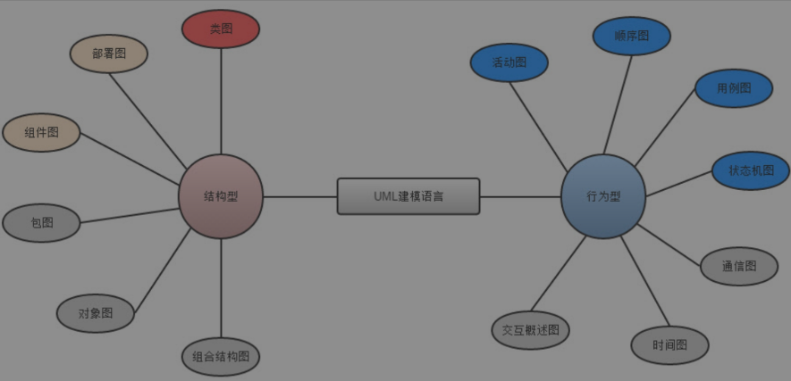
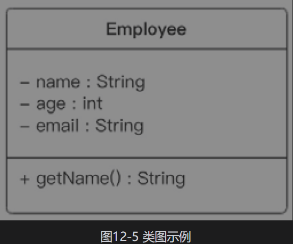
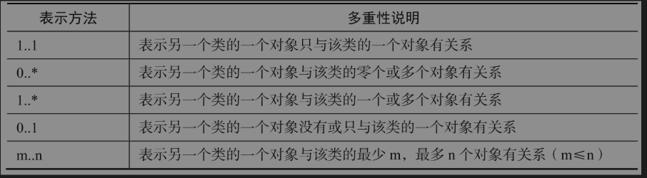
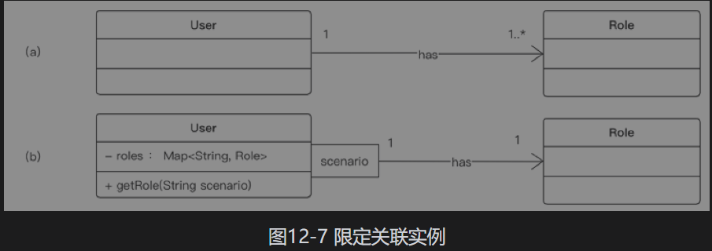
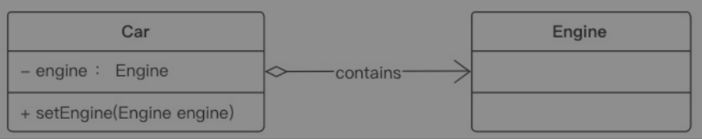

#### 1、黄金三问

##### 1.1 什么是UML建模工具

统一建模语言（Unified Modeling Language，UML）

##### 1.2 为什么要用UML

为开发团队提供标准通用的设计语言来开发和构建计算机应用。**UML提出了一套IT专业人员期待多年的统一的标准建模符号。**通过使用UML，IT专业人员能够阅读和交流系统架构和设计规划，就像建筑工人多年来使用的建筑设计图一样。

**UML拥有一种定义良好、富有表现力的表示法，这对于软件开发过程非常重要。标准的表示法能够让分析师或者开发者描述一个场景、阐明一种架构，然后将这些无二义地告诉别人。**

UML建模语言分为结构型和行为型两种

 

类图用于表示类和它们之间的关系。
在分析时，我们利用类图来说明实体共同的角色和责任，这些实体提供了系统的行为；
在设计时，我们利用类图来记录类的结构，这些类构成了系统的架构。
在类图中，两个基本元素就是类和类之间的关系。

##### 1.3 怎么用UML

#### 2、使用

##### 2.1 类的UML表示法

在UML中，类由类名、属性和操作三部分组成。
(1)类名(Name)：每个类都必须有一个名字，类名是一个字符串。
(2)属性(Attributes)：指类的性质，即类的成员变量。一个类可以有任意多个属性，也可以没有属性。
(3)操作(Operations)：指类的任意一个实例对象都可以使用的行为，是类的成员方法。

##### 2.2 例子

在UML类图中定义一个Employee类，它包含属性name、age和email，以及操作getName()

 

```java
public class Employee{
    private String name;
    private int age;
    private String email;
    
    public void getName(){
        return name;
    }
}
```

类图中属性和操作的格式有规格说明，
属性规格说明格式是“可见性　属性名称：类型”，比如“-name：String”。
操作规格说明格式是“可见性　操作名称（参数名称：类型）：返回值类型”，比如“+getName()：String”。

其中可见性、名称和类型的定义如下。
• 可见性：表示该属性对类外的元素而言是否可见，包括公有的(public)、私有的(private)和受保护的(protected)3种，在类图中分别用符号+、-和＃表示。
• 名称：按照惯例，类的名称以大写字母开头，单词之间使用驼峰隔开。属性和操作的名称以小写字母开头，后续单词使用驼峰。
• 类型：表示属性的数据类型，可以是基本数据类型，也可以是用户自定义类型。类和类之间的关系，主要有关联关系、依赖关系和泛化关系等。

#### 3、类的关联关系

##### 3.1 双向关联

默认情况下，关联是双向的。例如，一个教师(Teacher)可以教一到多门课程(Course)，一门课程只能被一个教师教。因此，Teacher类和Course类之间具有双向关联关系，如图12-6所示。

 

在图12-6中，三角形标注表示关联关系的阅读方向，是可选的。直线两边的数字代表关联的重数性(Multiplicity)，也是可选的，表示两个关联对象在数量上的对应关系。在UML中，对象之间的多重性可以直接在关联直线上用一个数字或数字范围表示。

对象之间可以存在多种多重性关联关系，常见的多重性表示方式如表12-1所示。

表12-1 常见的多重性表示方式


##### 3.2 限定关联

限定关联(qualified association)具有限定符(qualifier)，限定符的作用类似于HashMap中的键(key)，用于从一个集合中选择一个或多个对象。例如，一个用户(User)可以有多个角色(Role)，但是在一个场景(scenario)中，它只能有一种角色。

对于限定关联，有一点需要注意，即多重性的变化。例如，比较图12-7(a)和图12-7(b)，限定减少了在关联目标端的多重性，通常是由多变为一，因为限定关联通常是从较大集合中选择一个实例。

 

在代码实现限定关联时，成员变量通常是Map，而Map的key就是限定符，图12-7(b)对应的Java代码片段如下：

```java
public class User{
    private Map<String, Role> roles;
    public Role getRole(String scenario){
        return roles.get(scenario);
    }
}
public class Role {
}
```


##### 3.3 单向关联

##### 3.4 自关联

##### 3.5 聚合关系

聚合(Aggregation)关系表示整体与部分的关联关系。在聚合关系中，成员对象是整体对象的一部分，但是成员对象可以脱离整体对象而独立存在。在UML中，聚合关系用带空心菱形的直线表示。例如，发动机(Engine)是汽车(Car)的组成部分，但是发动机可以独立存在，因此汽车和发动机是聚合关系，如图12-10所示。

 

在代码中实现聚合关系时，成员对象通常作为构造方法、Setter方法或业务方法的参数注入整体对象中。

```java
public class Car{
    private Engine engine;
    // 构造注入
	public Car(Engine engine){
        this.engine = engine;
    }
    // 设值注入
    public void setEngine(Engine engine){
        this.engine = engine;
    }
}
public class Engine{
}
```


##### 3.6 组合关系

组合(Composition)关系也表示类之间整体和部分的关联关系，但是在组合关系中，整体对象可以控制成员对象的生命周期。一旦整体对象不存在，那么成员对象也将不存在，成员对象与整体对象之间具有“同生共死”的关系。在UML中，组合关系用带实心菱形的直线表示。

 

用代码实现组合关系时，通常在整体类的构造方法中直接实例化成员类。因为成员对象域整体对象有同样的生命周期，也就是要“同共生死”，这也是组合和聚合的主要区别之一。

```java
public class Head{
    private Mouth mouth;
    public Head(){
        // 实例化成员类
        mouth = new Mouth(); 
    }
}
public class Mouth{
    
}
```


#### 4、类依赖关系

第一种方式是最常用的，将一个类的对象作为另一个类中方法的参数；
第二种方式是在一个类的方法中将另一个类的对象作为其局部变量；
第三种方式是在一个类的方法中调用另一个类的静态方法。

```java
1、public void greet(Person person) {
    // 将一个类的对象作为另一个类中方法的参数
	System.out.println("Hello, " + person.getName());
}
2、public void performCalculation() {
    // 在方法内部创建另一个类的对象
    MathHelper helper = new MathHelper();
    int result = helper.add(5, 3); // 使用MathHelper类的对象
    System.out.println("Calculation result: " + result);
}
3、 public void performCalculation() {
    // 调用Utility类的静态方法
    int result = Utility.multiply(5, 3);
    System.out.println("Multiplication result: " + result);
}
```

#### 5、类的泛化关系

#### 6、类与接口的实现关系


