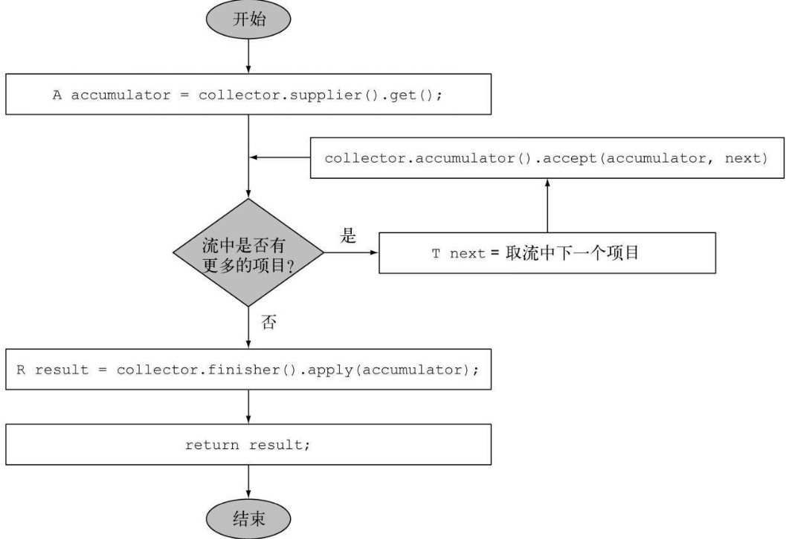
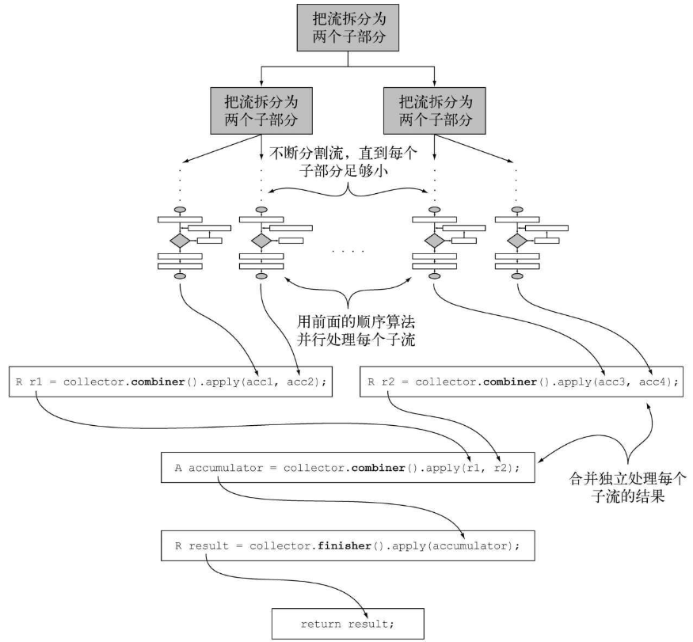

####  1、Collector源码

```java
public interface Collector<T, A, R> {
    // T是流中要收集的项目的泛型。
    // A是累加器的类型，累加器是在收集过程中用于累积部分结果的对象。
    // R是收集操作得到的对象（通常但并不一定是集合）的类型。
    Supplier<A> supplier();

    BiConsumer<A, T> accumulator();

    BinaryOperator<A> combiner();

    Function<A, R> finisher();

    Set<Characteristics> characteristics();

    public static<T, R> Collector<T, R, R> of(Supplier<R> supplier,
                                              BiConsumer<R, T> accumulator,
                                              BinaryOperator<R> combiner,
                                              Characteristics... characteristics) {
        Objects.requireNonNull(supplier);
        Objects.requireNonNull(accumulator);
        Objects.requireNonNull(combiner);
        Objects.requireNonNull(characteristics);
        Set<Characteristics> cs = (characteristics.length == 0) ? Collectors.CH_ID : 									Collections.unmodifiableSet(EnumSet.of(
            						Collector.Characteristics.IDENTITY_FINISH,characteristics));
        return new Collectors.CollectorImpl<>(supplier, accumulator, combiner, cs);
    }

   
    public static<T, A, R> Collector<T, A, R> of(Supplier<A> supplier,
                                                 BiConsumer<A, T> accumulator,
                                                 BinaryOperator<A> combiner,
                                                 Function<A, R> finisher,
                                                 Characteristics... characteristics) {
        Objects.requireNonNull(supplier);
        Objects.requireNonNull(accumulator);
        Objects.requireNonNull(combiner);
        Objects.requireNonNull(finisher);
        Objects.requireNonNull(characteristics);
        Set<Characteristics> cs = Collectors.CH_NOID;
        if (characteristics.length > 0) {
            cs = EnumSet.noneOf(Characteristics.class);
            Collections.addAll(cs, characteristics);
            cs = Collections.unmodifiableSet(cs);
        }
        return new Collectors.CollectorImpl<>(supplier, accumulator, combiner, finisher, cs);
    }
    
    enum Characteristics {
        CONCURRENT,
        UNORDERED,
        IDENTITY_FINISH
    }
}
```

#### 2、理解Collector接口方法

现在我们可以一个个来分析Collector接口声明的五个方法了。通过分析，你会注意到，前四个方法都会返回一个会被collect方法调用的函数，而**第五个方法characteristics则提供了一系列特征，也就是一个提示列表，告诉collect方法在执行归约操作的时候可以应用哪些优化（比如并行化）**。

##### 2.1 建立新的结果容器：supplier方法

作用：supplier方法必须返回一个结果为空的Supplier，也就是一个无参数函数，在调用时它会创建一个空的累加器实例，供数据收集过程使用。将累加器本身作为结果返回的收集器。

ToListCollector（自定义Collector），在对空流执行操作的时候，这个空的累加器也代表了收集过程的结果。

```java
// 写法一
public Supplier<List<T>> supplier() {
    return ()-> new ArrayList<T>();
}

// 写法二
public Supplier<List<T>> supplier() {
    return ArrayList::new;
}
```

##### 2.2 将元素添加到结果容器：accumulator方法

作用：accumulator方法会返回执行归约操作的函数。该函数返回void，因为累加器是原位更新，即函数的执行改变了它的内部状态以体现遍历元素的效果。

入参：当遍历到流中第n个元素时，这个函数执行时会有两个参数：保存归约结果的累加器（已收集了流中的前n-1个项目），还有第n个元素本身。

ToListCollector（自定义实现Collector），这个函数仅仅会把当前项目添加至已经遍历过的项目的列表：

```java
// 写法一
public BiConsumer<List<T>, T> accumulator() {
	return (list, item)-> list.add(item);
}

// 写法二
public BiConsumer<List<T>, T> accumulator() {
    return List::add;
}
```

##### 2.3 对结果容器应用最终转换：finisher方法

在遍历完流后，finisher方法必须返回在累积过程的最后要调用的一个函数，以便将累加器对象转换为整个集合操作的最终结果。

在ToListCollector中累加器对象恰好符合预期的最终结果，因此无需进行转换。所以finisher方法只需返回identity函数：

```java
public Function<List<T>, List<T>> finisher() {
	return Function.identity();
}
```

##### 2.4 图解

这三个方法已经足以对流进行顺序归约，至少从逻辑上看可以按图6-7进行。实践中的实现细节可能还要复杂一点，一方面是因为流的延迟性质，可能在collect操作之前还需要完成其他中间操作的流水线，另一方面则是理论上可能要进行并行归约。

 

##### 2.5 合并两个结果容器：combiner方法

四个方法中的最后一个——combiner方法会返回一个供归约操作使用的函数，它定义了对流的各个子部分进行并行处理时，各个子部分归约所得的累加器要如何合并。对于toList而言，这个方法的实现非常简单，只要把从流的第二个部分收集到的项目列表加到遍历第一部分时得到的列表后面就行了：

```java
public BinaryOperator<List<T>> combiner() {
    return (list1, list2)-> {
        list1.addAll(list2);
        return list1; }
}
```

有了这第四个方法，就可以对流进行并行归约了。它会用到Java 7中引入的分支/合并框架和Spliterator抽象，我们会在下一章中讲到。这个过程类似于图6-8所示，这里会详细介绍。

  

1）原始流会以递归方式拆分为子流，直到定义流是否需要进一步拆分的一个条件为非（如果分布式工作单位太小，并行计算往往比顺序计算要慢，而且要是生成的并行任务比处理器内核数多很多的话就毫无意义了）。

2）所有的子流都可以并行处理，即对每个子流应用的2.4中顺序归约算法。

3）使用收集器combiner方法返回的函数，将所有的部分结果两两合并。这时会把原始流每次拆分时得到的子流对应的结果合并起来。

##### 2.6 characteristics方法

最后一个方法——characteristics会返回一个不可变的Characteristics集合，它定义了收集器的行为——尤其是关于流是否可以并行归约，以及可以使用哪些优化的提示。Characteristics是一个包含三个项目的枚举。

❑ UNORDERED——归约结果不受流中项目的遍历和累积顺序的影响。

❑ CONCURRENT——accumulator函数可以从多个线程同时调用，且该收集器可以并行归约流。如果收集器没有标为UNORDERED，那它仅在用于无序数据源时才可以并行归约。

❑ IDENTITY_FINISH——这表明完成器方法返回的函数是一个恒等函数，可以跳过。这种情况下，累加器对象将会直接用作归约过程的最终结果。这也意味着，将累加器A不加检查地转换为结果R是安全的。

我们迄今开发的ToListCollector是IDENTITY_FINISH的，因为用来累积流中元素的List已经是我们要的最终结果，用不着进一步转换了，但它并不是UNORDERED，因为用在有序流上的时候，我们还是希望顺序能够保留在得到的List中。最后，它是CONCURRENT的，但我们刚才说过了，仅仅在背后的数据源无序时才会并行处理。


