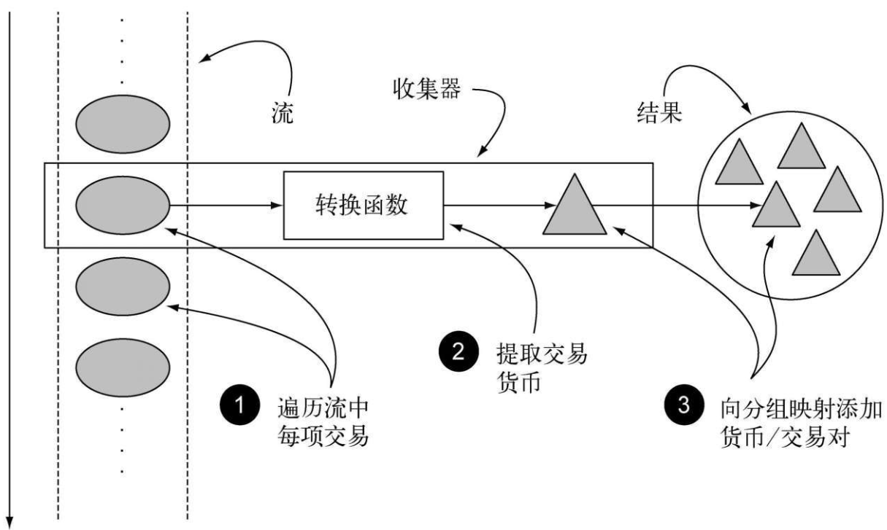

❑ 用Collectors类创建和使用收集器

❑ 将数据流归约为一个值

❑ 汇总：归约的特殊情况

❑ 数据分组和分区

❑ 开发自己的自定义收集器

#### 1、jdk8中的Stream

流可以用类似于数据库的操作帮助你处理集合。你可以把Java 8的流看作花哨又懒惰的数据集迭代器。

它们支持两种类型的操作：**中间操作（如filter或map）和终端操作（如count、findFirst、forEach和reduce）**

```java
Map<Currency, List<Transaction>> transactionsByCurrencies=
	transactions.stream().collect(groupingBy(Transaction::getCurrency));
```

 


#### 2、Collector

```java
public interface Collector<T, A, R> {
    /**
     * A function that creates and returns a new mutable result container.
     *
     * @return a function which returns a new, mutable result container
     */
    Supplier<A> supplier();

    /**
     * A function that folds a value into a mutable result container.
     *
     * @return a function which folds a value into a mutable result container
     */
    BiConsumer<A, T> accumulator();

    /**
     * A function that accepts two partial results and merges them.  The
     * combiner function may fold state from one argument into the other and
     * return that, or may return a new result container.
     *
     * @return a function which combines two partial results into a combined
     * result
     */
    BinaryOperator<A> combiner();

    /**
     * Perform the final transformation from the intermediate accumulation type
     * {@code A} to the final result type {@code R}.
     *
     * <p>If the characteristic {@code IDENTITY_TRANSFORM} is
     * set, this function may be presumed to be an identity transform with an
     * unchecked cast from {@code A} to {@code R}.
     *
     * @return a function which transforms the intermediate result to the final
     * result
     */
    Function<A, R> finisher();

    /**
     * Returns a {@code Set} of {@code Collector.Characteristics} indicating
     * the characteristics of this Collector.  This set should be immutable.
     *
     * @return an immutable set of collector characteristics
     */
    Set<Characteristics> characteristics();

    /**
     * Returns a new {@code Collector} described by the given {@code supplier},
     * {@code accumulator}, and {@code combiner} functions.  The resulting
     * {@code Collector} has the {@code Collector.Characteristics.IDENTITY_FINISH}
     * characteristic.
     *
     * @param supplier The supplier function for the new collector
     * @param accumulator The accumulator function for the new collector
     * @param combiner The combiner function for the new collector
     * @param characteristics The collector characteristics for the new
     *                        collector
     * @param <T> The type of input elements for the new collector
     * @param <R> The type of intermediate accumulation result, and final result,
     *           for the new collector
     * @throws NullPointerException if any argument is null
     * @return the new {@code Collector}
     */
    public static<T, R> Collector<T, R, R> of(Supplier<R> supplier,
                                              BiConsumer<R, T> accumulator,
                                              BinaryOperator<R> combiner,
                                              Characteristics... characteristics) {
        Objects.requireNonNull(supplier);
        Objects.requireNonNull(accumulator);
        Objects.requireNonNull(combiner);
        Objects.requireNonNull(characteristics);
        Set<Characteristics> cs = (characteristics.length == 0)
                                  ? Collectors.CH_ID
                                  : Collections.unmodifiableSet(EnumSet.of(Collector.Characteristics.IDENTITY_FINISH,
                                                                           characteristics));
        return new Collectors.CollectorImpl<>(supplier, accumulator, combiner, cs);
    }

    /**
     * Returns a new {@code Collector} described by the given {@code supplier},
     * {@code accumulator}, {@code combiner}, and {@code finisher} functions.
     *
     * @param supplier The supplier function for the new collector
     * @param accumulator The accumulator function for the new collector
     * @param combiner The combiner function for the new collector
     * @param finisher The finisher function for the new collector
     * @param characteristics The collector characteristics for the new
     *                        collector
     * @param <T> The type of input elements for the new collector
     * @param <A> The intermediate accumulation type of the new collector
     * @param <R> The final result type of the new collector
     * @throws NullPointerException if any argument is null
     * @return the new {@code Collector}
     */
    public static<T, A, R> Collector<T, A, R> of(Supplier<A> supplier,
                                                 BiConsumer<A, T> accumulator,
                                                 BinaryOperator<A> combiner,
                                                 Function<A, R> finisher,
                                                 Characteristics... characteristics) {
        Objects.requireNonNull(supplier);
        Objects.requireNonNull(accumulator);
        Objects.requireNonNull(combiner);
        Objects.requireNonNull(finisher);
        Objects.requireNonNull(characteristics);
        Set<Characteristics> cs = Collectors.CH_NOID;
        if (characteristics.length > 0) {
            cs = EnumSet.noneOf(Characteristics.class);
            Collections.addAll(cs, characteristics);
            cs = Collections.unmodifiableSet(cs);
        }
        return new Collectors.CollectorImpl<>(supplier, accumulator, combiner, finisher, cs);
    }

    /**
     * Characteristics indicating properties of a {@code Collector}, which can
     * be used to optimize reduction implementations.
     */
    enum Characteristics {
        /**
         * Indicates that this collector is <em>concurrent</em>, meaning that
         * the result container can support the accumulator function being
         * called concurrently with the same result container from multiple
         * threads.
         *
         * <p>If a {@code CONCURRENT} collector is not also {@code UNORDERED},
         * then it should only be evaluated concurrently if applied to an
         * unordered data source.
         */
        CONCURRENT,

        /**
         * Indicates that the collection operation does not commit to preserving
         * the encounter order of input elements.  (This might be true if the
         * result container has no intrinsic order, such as a {@link Set}.)
         */
        UNORDERED,

        /**
         * Indicates that the finisher function is the identity function and
         * can be elided.  If set, it must be the case that an unchecked cast
         * from A to R will succeed.
         */
        IDENTITY_FINISH
    }
}
```


#### 1、Collector的静态工具类：Collectors类

Collector会对元素应用一个转换函数（很多时候是不体现任何效果的恒等转换，例如toList），并将结果累积在一个数据结构中，从而产生这一过程的最终输出。

```java
List<Transaction> transactions=
    transactionStream.collect(Collectors.toList());
```

Colectors类提供的工厂方法

三大功能：
❑ 将流元素归约和汇总为一个值
❑ 元素分组
❑ 元素分区

利用counting工厂方法返回的收集器，数一数菜单里有多少种菜：

```java
long howManyDishes=menu.stream().collect(Collectors.counting());
// 等价于
long howManyDishes=menu.stream().count();
```

已导入了Collectors类的所有静态工厂方法

```java
// 不建议这样使用（自己的观点）
import static java.util.stream.Collectors.＊;
```

这样你就可以写counting()而用不着写Collectors.counting()之类的了。

##### 1.1 查找流中的最大值和最小值


##### 1.2 Collectors类的静态工厂方法

| 工厂方法   | 返回类型    | 用于                             |
| ---------- | ----------- | -------------------------------- |
| **toList** | **List<T>** | **把流中所有项目收集到一个List** |

```java
List<Dish> dishes = menuStream.collect(toList());
```


| 工厂方法  | 返回类型   | 用于                                        |
| --------- | ---------- | ------------------------------------------- |
| **toSet** | **Set<T>** | **把流中所有项目收集到一个Set，删除重复项** |

```java
Set<Dish> dishes = menuStream.collect(toSet());
```


| 工厂方法         | 返回类型          | 用于                                           |
| ---------------- | ----------------- | ---------------------------------------------- |
| **toCollection** | **Collection<T>** | **把流中所有项目收集到给定的供应源创建的集合** |

```java
Collection<Dish> dishes = menuStream.collect(toCollection(), ArrayList :: new)
```


| **工厂方法** | **返回类型** | **用于**               |
| ------------ | ------------ | ---------------------- |
| **counting** | **Long**     | **计算流中元素的个数** |

```java
long howManyDishes = menuStream.collect(counting());
```


| 工厂方法    | 返回类型    | 用于                             |
| ----------- | ----------- | -------------------------------- |
| **summing** | **Integer** | **对流中项目的一个整数属性求和** |

```java
int totalCalories = menuStream.collect(summingInt(Dish :: getCalories));
```


| 工厂方法         | 返回类型   | 用于                                |
| ---------------- | ---------- | ----------------------------------- |
| **averagingInt** | **Double** | **计算流中项目Integer属性的平均值** |

```java
double avgCalories = menuStream.collect(averagingInt(Dish :: getCalories));
```


| 工厂方法           | 返回类型                 | 用于                                                         |
| ------------------ | ------------------------ | ------------------------------------------------------------ |
| **summarizingInt** | **IntSummaryStatistics** | **收集关于流中项目Integer属性的统计值，例如最大、最小、总和与平均值** |

```java
IntSummaryStatistics menuStatistics = menuStream.collect(summarizingInt(Dish :: getCalories))
```


| 工厂方法    | 返回类型   | 用于                                               |
| ----------- | ---------- | -------------------------------------------------- |
| **joining** | **String** | **连接流中每个项目调用toString方法所生成的字符串** |

```java
String shortMenu = menuStream.map(Dish :: getName).collect(joining(","));
```


| 工厂方法  | 返回类型        | 用于                                                         |
| --------- | --------------- | ------------------------------------------------------------ |
| **maxBy** | **Optional<T>** | **一个包裹了流中按照给定比较器选出的最大元素的Optional，或如果流为空则为Optional.empty()** |

```java
Optional<Dish> fattest = menuStream.collect(maxBy(comparingInt(Dish :: getCalories)));
```


| 工厂方法  | 返回类型        | 用于                                                         |
| --------- | --------------- | ------------------------------------------------------------ |
| **minBy** | **Optional<T>** | **一个包裹了流中按照给定比较器选出的最小元素的Optional，或如果流为空则为Optional.empty()** |

```java
Optional<Dish> lightest = menuStream.collect(minBy(comparingInt(Dish :: getCalories)));
```


| 工厂方法     | 返回类型               | 用于                                                         |
| ------------ | ---------------------- | ------------------------------------------------------------ |
| **reducing** | **归约操作产生的类型** | **从一个作为累加器的初始值开，利用BinaryOperator与流中的元素逐个结合，从而将流归约为单个值** |

```java
int totalCalories = menuStream.collect(reducing(0, Dish :: getCalories, Integer :: sum));
```


| 工厂方法       | 返回类型            | 用于                                                      |
| -------------- | ------------------- | --------------------------------------------------------- |
| **groupingBy** | **Map<K, List<T>>** | **根据流中一个属性的值作分组，并将属性值作为结果Map的键** |

```java
Map<Dish.Type, List<Dish>> dishesByType = menuStream.collect(groupBy(Dish :: getType));
```


| 工厂方法           | 返回类型               | 用于                                               |
| ------------------ | ---------------------- | -------------------------------------------------- |
| **partitioningBy** | **Map<Boolean, List>** | **根据流中每个项目应用谓词的结果来对项目进行分区** |

```java
Map<Boolean, List<Dish>> vegetarianDishes = menuStream.collect(partitioningBy(Dish :: isVegetarian));
```


#### 3、stream接口中的reduce()与Collectors.reducing()区别

##### 3.1 **`reduce()`** 

流操作中的一个终止操作，它接受一个二元操作（binary operator），用于将流中的元素合并成一个单一的结果。

```java
Stream<Integer> stream = Arrays.asList(1, 2, 3, 4, 5, 6).stream();
List<Integer> numbers = stream.reduce(
    new ArrayList<Integer>(),  // supplier: 提供空的集合
    (List<Integer> l, Integer e) -> {
        l.add(e);
        return l;
    },                         // accumulator: 向集合中添加元素
    (List<Integer> l1, List<Integer> l2) -> {
        l1.addAll(l2);
        return l1;
    });  					// combiner: 合并两个集合
```


##### 3.2 `Collectors.reducing()`

❑ 第一个参数是归约操作的起始值，也是流中没有元素时的返回值，所以很显然对于数值和而言0是一个合适的值。

❑ 第二个参数就是你在6.2.2节中使用的函数，将菜肴转换成一个表示其所含热量的int。

❑ 第三个参数是一个BinaryOperator，将两个项目累积成一个同类型的值。这里它就是对两个int求和。

```java
int totalCalories=menu.stream().collect(reducing(
	0, Dish::getCalories, (i, j)-> i+j));
```


#### **单参数 `reducing()` 的特殊情况：**

`Collector.reducing(BinaryOperator<T> op)` 是一个工厂方法，它生成一个 **`Collector`** 来对流中的元素进行合并。它的行为类似于 **`reduce()`**，但它会将流的第一个元素作为累加器的初始值。

单参数的 `reducing` 方法就是 `Collector.of()` 三参数形式的一个简化版本，其第一个参数是流的第一个元素，第二个参数是 `恒等函数`（即返回元素本身的函数）。

```java
Stream<Integer> stream = Stream.of(1, 2, 3, 4, 5);

// 单参数 reducing 示例
Optional<Integer> result = stream.collect(Collectors.reducing(Integer::sum));

result.ifPresent(System.out::println);  // 输出 15

```

在上面的例子中，`Collectors.reducing(Integer::sum)` 会通过求和操作对流中的元素进行合并。这个方法将 **流的第一个元素作为初始值**，然后应用 `Integer::sum` 来合并流中的元素。因为这是单参数形式，所以 `reducing()` 会自动将流中的第一个元素作为起始值，而不需要显式提供初始值。


```java
String shortMenu=menu.stream().map(Dish::getName).collect(joining());
// 这会将每道菜转换为菜名，就像原先使用joining收集器的语句一样。然后用一个String作为累加器归约得到的字符串流，并将菜名逐个连接在它后面。
(1)String shortMenu=menu.stream().map(Dish::getName)
	.collect( reducing      ( (s1, s2)-> s1+s2 ) ).get();

// 这会将每道菜转换为菜名，就像原先使用joining收集器的语句一样。然后用一个String作为累加器归约得到的字符串流，并将菜名逐个连接在它后面。
(2)String shortMenu=menu.stream()
	.collect( reducing( (d1, d2)-> d1.getName()+d2.getName() ) ).get();

// 这会将每道菜转换为菜名，就像原先使用joining收集器的语句一样。然后用一个String作为累加器归约得到的字符串流，并将菜名逐个连接在它后面。
(3)String shortMenu=menu.stream()
	.collect( reducing( "", Dish::getName, (s1, s2)-> s1+s2 ) );
```


#### 4、分组
