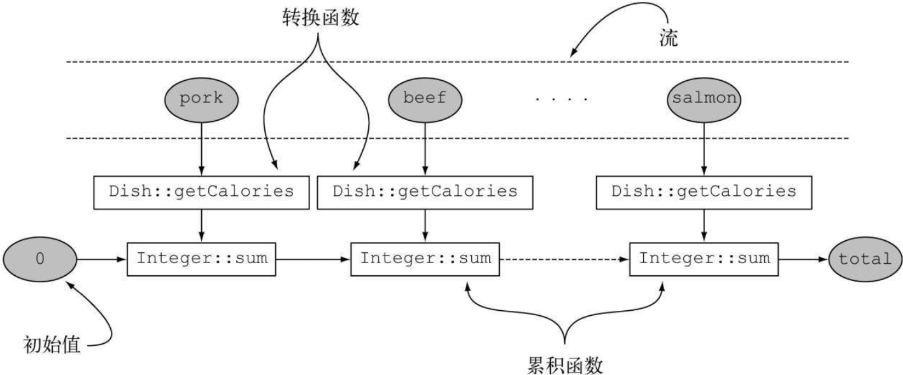

#### 1、reducing

##### 2.1 一个参数源码

```java
public static <T> Collector<T, ?, Optional<T>>
    reducing(BinaryOperator<T> op) {
        class OptionalBox implements Consumer<T> {
            T value = null;
            boolean present = false;

            @Override
            public void accept(T t) {
                if (present) {
                    value = op.apply(value, t);
                }
                else {
                    value = t;
                    present = true;
                }
            }
        }

        return new CollectorImpl<T, OptionalBox, Optional<T>>(
                OptionalBox::new, OptionalBox::accept,
                (a, b) -> { if (b.present) a.accept(b.value); return a; },
                a -> Optional.ofNullable(a.value), CH_NOID);
}
```

###### 2.1.1 示例

```java
Stream<Integer> stream = Stream.of(1, 2, 3, 4, 5);

// 单参数 reducing 示例
Optional<Integer> result = stream.collect(Collectors.reducing(Integer::sum));

result.ifPresent(System.out::println);  // 输出 15

// 请注意，就像流的任何单参数reduce操作一样，reduce(Integer::sum)返回的不是int而是Optional<Integer>，以便在空流的情况下安全地执行归约操作。
```


##### 2.2 三个参数源码

```java
public static <T, U> Collector<T, ?, U> reducing(
    						  U identity,
                                Function<? super T, ? extends U> mapper,
                                BinaryOperator<U> op) {
        return new CollectorImpl<>(
                boxSupplier(identity),
                (a, t) -> { a[0] = op.apply(a[0], mapper.apply(t)); },
                (a, b) -> { a[0] = op.apply(a[0], b[0]); return a; },
                a -> a[0], CH_NOID);
}
```

###### 2.2.1 示例

```java
int totalCalories=menu.stream().collect(reducing(
	0,                       ===========> 初始值
    Dish::getCalories,        ===========> 转换函数
    (i, j)-> i+j)             ===========> 累计函数
);
```

❑ 第一个参数是归约操作的起始值，也是流中没有元素时的返回值，所以很显然对于数值和而言0是一个合适的值。

❑ 第二个参数就是你在6.2.2节中使用的函数，将菜肴转换成一个表示其所含热量的int。

❑ 第三个参数是一个BinaryOperator，将两个项目累积成一个同类型的值。这里它就是对两个int求和。

 

##### 2.3 示例

```java
String shortMenu=menu.stream().map(Dish::getName).collect(joining());
// 这会将每道菜转换为菜名，就像原先使用joining收集器的语句一样。然后用一个String作为累加器归约得到的字符串流，并将菜名逐个连接在它后面。
(1)String shortMenu=menu.stream().map(Dish::getName)
	.collect( reducing      ( (s1, s2)-> s1+s2 ) ).get();

// 这无法编译，因为reducing接受的参数是一个BinaryOperator<t>，也就是一个BiFunction<T, T, T>。这就意味着它需要的函数必须能接受两个参数，然后返回一个相同类型的值，但这里用的Lambda表达式接受的参数是两个菜，返回的却是一个字符串。
(2)String shortMenu=menu.stream()
	.collect( reducing( (d1, d2)-> d1.getName()+d2.getName() ) ).get();

// 这会把一个空字符串作为累加器来进行归约，在遍历菜肴流时，它会把每道菜转换成菜名，并追加到累加器上。请注意，我们前面讲过，reducing要返回一个Optional并不需要三个参数，因为如果是空流的话，它的返回值更有意义——也就是作为累加器初始值的空字符串。
(3)String shortMenu=menu.stream()
	.collect( reducing( "", Dish::getName, (s1, s2)-> s1+s2 ) );
```

#### 2、mapping

```java
public static <T, U, A, R> Collector<T, ?, R> mapping(
    					Function<? super T, ? extends U> mapper,
                          Collector<? super U, A, R> downstream) {
        BiConsumer<A, ? super U> downstreamAccumulator = downstream.accumulator();
        return new CollectorImpl<>(downstream.supplier(),
                                   (r, t) -> downstreamAccumulator.accept(r, mapper.apply(t)),
                                   downstream.combiner(), downstream.finisher(),
                                   downstream.characteristics());
}
```

入参：

1）`Function<? super T, ? extends U> mapper`

接收一个Function函数，接收一个`? super T`入参， 返回一个`? extends U`参数

2）`Collector<? super U, A, R> downstream`

一个Collector对象

#### 3、groupingBy

```java
public static <T, K, D, A, M extends Map<K, D>>
    Collector<T, ?, M> groupingBy(Function<? super T, ? extends K> classifier,
                                  Supplier<M> mapFactory,
                                  Collector<? super T, A, D> downstream) {
        Supplier<A> downstreamSupplier = downstream.supplier();
        BiConsumer<A, ? super T> downstreamAccumulator = downstream.accumulator();
        BiConsumer<Map<K, A>, T> accumulator = (m, t) -> {
            K key = Objects.requireNonNull(classifier.apply(t), "element cannot be mapped to a null key");
            A container = m.computeIfAbsent(key, k -> downstreamSupplier.get());
            downstreamAccumulator.accept(container, t);
        };
        BinaryOperator<Map<K, A>> merger = Collectors.<K, A, Map<K, A>>mapMerger(downstream.combiner());
        @SuppressWarnings("unchecked")
        Supplier<Map<K, A>> mangledFactory = (Supplier<Map<K, A>>) mapFactory;

        if (downstream.characteristics().contains(Collector.Characteristics.IDENTITY_FINISH)) {
            return new CollectorImpl<>(mangledFactory, accumulator, merger, CH_ID);
        }
        else {
            @SuppressWarnings("unchecked")
            Function<A, A> downstreamFinisher = (Function<A, A>) downstream.finisher();
            Function<Map<K, A>, M> finisher = intermediate -> {
                intermediate.replaceAll((k, v) -> downstreamFinisher.apply(v));
                @SuppressWarnings("unchecked")
                M castResult = (M) intermediate;
                return castResult;
            };
            return new CollectorImpl<>(mangledFactory, accumulator, merger, finisher, CH_NOID);
        }
    }
```


#### 4、partitioningBy

```java
public static <T>
    Collector<T, ?, Map<Boolean, List<T>>> partitioningBy(Predicate<? super T> predicate) {
        return partitioningBy(predicate, toList());
}
```


```java
public static <T, D, A>
    Collector<T, ?, Map<Boolean, D>> partitioningBy(Predicate<? super T> predicate,
                                                    Collector<? super T, A, D> downstream) {
        BiConsumer<A, ? super T> downstreamAccumulator = downstream.accumulator();
        BiConsumer<Partition<A>, T> accumulator = (result, t) ->
                downstreamAccumulator.accept(predicate.test(t) ? result.forTrue : result.forFalse, t);
        BinaryOperator<A> op = downstream.combiner();
        BinaryOperator<Partition<A>> merger = (left, right) ->
                new Partition<>(op.apply(left.forTrue, right.forTrue),
                                op.apply(left.forFalse, right.forFalse));
        Supplier<Partition<A>> supplier = () ->
                new Partition<>(downstream.supplier().get(),
                                downstream.supplier().get());
        if (downstream.characteristics().contains(Collector.Characteristics.IDENTITY_FINISH)) {
            return new CollectorImpl<>(supplier, accumulator, merger, CH_ID);
        }
        else {
            Function<Partition<A>, Map<Boolean, D>> finisher = par ->
                    new Partition<>(downstream.finisher().apply(par.forTrue),
                                    downstream.finisher().apply(par.forFalse));
            return new CollectorImpl<>(supplier, accumulator, merger, finisher, CH_NOID);
        }
    }
```


#### 5、Collectors类的静态工厂方法

| 工厂方法   | 返回类型    | 用于                             |
| ---------- | ----------- | -------------------------------- |
| **toList** | **List<T>** | **把流中所有项目收集到一个List** |

```java
List<Dish> dishes = menuStream.collect(toList());
```


| 工厂方法  | 返回类型   | 用于                                        |
| --------- | ---------- | ------------------------------------------- |
| **toSet** | **Set<T>** | **把流中所有项目收集到一个Set，删除重复项** |

```java
Set<Dish> dishes = menuStream.collect(toSet());
```


| 工厂方法         | 返回类型          | 用于                                           |
| ---------------- | ----------------- | ---------------------------------------------- |
| **toCollection** | **Collection<T>** | **把流中所有项目收集到给定的供应源创建的集合** |

```java
Collection<Dish> dishes = menuStream.collect(toCollection(), ArrayList :: new)
```


| **工厂方法** | **返回类型** | **用于**               |
| ------------ | ------------ | ---------------------- |
| **counting** | **Long**     | **计算流中元素的个数** |

```java
long howManyDishes = menuStream.collect(counting());
```


| 工厂方法    | 返回类型    | 用于                             |
| ----------- | ----------- | -------------------------------- |
| **summing** | **Integer** | **对流中项目的一个整数属性求和** |

```java
int totalCalories = menuStream.collect(summingInt(Dish :: getCalories));
```


| 工厂方法         | 返回类型   | 用于                                |
| ---------------- | ---------- | ----------------------------------- |
| **averagingInt** | **Double** | **计算流中项目Integer属性的平均值** |

```java
double avgCalories = menuStream.collect(averagingInt(Dish :: getCalories));
```


| 工厂方法           | 返回类型                 | 用于                                                         |
| ------------------ | ------------------------ | ------------------------------------------------------------ |
| **summarizingInt** | **IntSummaryStatistics** | **收集关于流中项目Integer属性的统计值，例如最大、最小、总和与平均值** |

```java
IntSummaryStatistics menuStatistics = menuStream.collect(summarizingInt(Dish :: getCalories))
```


| 工厂方法    | 返回类型   | 用于                                               |
| ----------- | ---------- | -------------------------------------------------- |
| **joining** | **String** | **连接流中每个项目调用toString方法所生成的字符串** |

```java
String shortMenu = menuStream.map(Dish :: getName).collect(joining(","));
```


| 工厂方法  | 返回类型        | 用于                                                         |
| --------- | --------------- | ------------------------------------------------------------ |
| **maxBy** | **Optional<T>** | **一个包裹了流中按照给定比较器选出的最大元素的Optional，或如果流为空则为Optional.empty()** |

```java
Optional<Dish> fattest = menuStream.collect(maxBy(comparingInt(Dish :: getCalories)));
```


| 工厂方法  | 返回类型        | 用于                                                         |
| --------- | --------------- | ------------------------------------------------------------ |
| **minBy** | **Optional<T>** | **一个包裹了流中按照给定比较器选出的最小元素的Optional，或如果流为空则为Optional.empty()** |

```java
Optional<Dish> lightest = menuStream.collect(minBy(comparingInt(Dish :: getCalories)));
```


| 工厂方法     | 返回类型               | 用于                                                         |
| ------------ | ---------------------- | ------------------------------------------------------------ |
| **reducing** | **归约操作产生的类型** | **从一个作为累加器的初始值开，利用BinaryOperator与流中的元素逐个结合，从而将流归约为单个值** |

```java
int totalCalories = menuStream.collect(reducing(0, Dish :: getCalories, Integer :: sum));
```


| 工厂方法       | 返回类型            | 用于                                                      |
| -------------- | ------------------- | --------------------------------------------------------- |
| **groupingBy** | **Map<K, List<T>>** | **根据流中一个属性的值作分组，并将属性值作为结果Map的键** |

```java
Map<Dish.Type, List<Dish>> dishesByType = menuStream.collect(groupBy(Dish :: getType));
```


| 工厂方法           | 返回类型               | 用于                                               |
| ------------------ | ---------------------- | -------------------------------------------------- |
| **partitioningBy** | **Map<Boolean, List>** | **根据流中每个项目应用谓词的结果来对项目进行分区** |

```java
Map<Boolean, List<Dish>> vegetarianDishes = menuStream.collect(partitioningBy(Dish :: isVegetarian));
```


