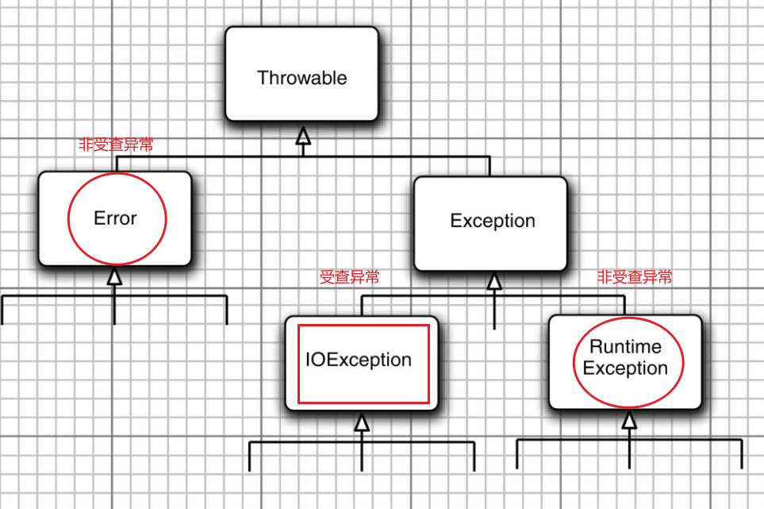

#### 1、异常分类

 

派生于RuntimeException的异常包含下面几种情况：

● 错误的类型转换。
● 数组访问越界。
● 访问null指针。

不是派生于RuntimeException的异常包括：

● 试图在文件尾部后面读取数据。
● 试图打开一个不存在的文件。
● 试图根据给定的字符串查找Class对象，而这个字符串表示的类并不存在。

#### 2、创建异常类

定义一个派生于Exception的类，或者派生于Exception子类的类。

例如，定义一个派生于IOException的类。习惯上，定义的类应该包含两个构造器，一个是默认的构造器；另一个是带有详细描述信息的构造器

```java
class FileFormatException extends IOException {
    public FileFormatException() {}
    public FileFormatException(String gripe) {
        super(gripe);
    }
}
```


